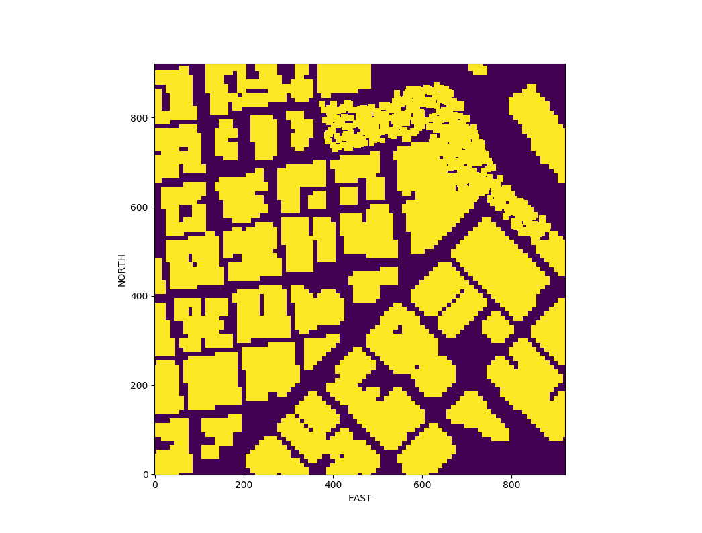

## Project: 3D Motion Planning


---


# Required Steps for a Passing Submission:
1. Load the 2.5D map in the colliders.csv file describing the environment.
2. Discretize the environment into a grid or graph representation.
3. Define the start and goal locations.
4. Perform a search using A* or other search algorithm.
5. Use a collinearity test or ray tracing method (like Bresenham) to remove unnecessary waypoints.
6. Return waypoints in local ECEF coordinates (format for `self.all_waypoints` is [N, E, altitude, heading], where the drone’s start location corresponds to [0, 0, 0, 0].
7. Write it up.
8. Congratulations!  Your Done!

## [Rubric](https://review.udacity.com/#!/rubrics/1534/view) Points
### Here I will consider the rubric points individually and describe how I addressed each point in my implementation.  

---
### Writeup / README

#### 1. Provide a Writeup / README that includes all the rubric points and how you addressed each one.  You can submit your writeup as markdown or pdf.  

You're reading it! Below I describe how I addressed each rubric point and where in my code each point is handled.

### Explain the Starter Code

#### 1. Explain the functionality of what's provided in `motion_planning.py` and `planning_utils.py`
`motion_planning.py` contains planning class MotionPlanning which inherits from a Udacity-provided Drone class, for methods provided by this class check this API: https://udacity.github.io/udacidrone/docs/drone-api.html 
This is script file uses principles of event driven programming.
1. At the start this script connects to Udacity simulator using Mavlink (you can download the simulator here https://github.com/udacity/FCND-Simulator-Releases/releases)
2. Starts the drone using Arming and Manual
3. in method plan_path() is computed path for navigation
4. contruct a grid map from 2.5D map in colliders.csv file 
5. contruct path using A* star algorith from grid map
6. sending waypoint constructed from path

`planning_utils.py` contains utilities for
 1. creating a grid map
 2. defines valid actions fro drone to take
 3. implementation of A* star algorithm (graph implementation) with its heuristic function
 4. create_graph function for generating 3D graph using Probabilistic Roadmap approach with KDTrees implementation (http://scikit-learn.org/stable/modules/generated/sklearn.neighbors.KDTree.html)
 5. can_connect function which uses LineString to check if the line is crossing any building (polygon) from shapely.geometry library http://shapely.readthedocs.io/en/stable/manual.html

And here's a lovely image of my results (ok this image has nothing to do with it, but it's a nice example of how to include images in your writeup!)


### Implementing Your Path Planning Algorithm

#### 1. Set your global home position
I have read the first line of the csv file, extract lat0 and lon0 as floating point values and use the self.set_home_position() method to set global home.
For readding the coordinates I am using regular expression to parse the first line of the csv file
```python
home = re.findall(r"[-+]?\d*\.*\d+", f.readline())
self.set_home_position(float(home[3]), float(home[1]), 0.0)
```

And here is a lovely picture of our downtown San Francisco environment from above!


#### 2. Set your current local position
Here as long as you successfully determine your local position relative to global home you'll be all set.

To set current position I firstly need to get a global position of the drone. Then I have to convert this global position to local position.

```python
# retrieve current global position
global_position = [self._longitude, self._latitude, self._altitude]
# convert to current local position using global_to_local()
local_position = global_to_local(global_position, self.global_home)
```

#### 3. Set grid start position from local position
This is another step in adding flexibility to the start location. As long as it works you're good to go!

#### 4. Set grid goal position from geodetic coords
This step is to add flexibility to the desired goal location. Should be able to choose any (lat, lon) within the map and have it rendered to a goal location on the grid.

#### 5. Modify A* to include diagonal motion (or replace A* altogether)
Minimal requirement here is to modify the code in planning_utils() to update the A* implementation to include diagonal motions on the grid that have a cost of sqrt(2), but more creative solutions are welcome. Explain the code you used to accomplish this step.

#### 6. Cull waypoints 
For this step you can use a collinearity test or ray tracing method like Bresenham. The idea is simply to prune your path of unnecessary waypoints. Explain the code you used to accomplish this step.


### Execute the flight
#### 1. Does it work?
It works!

### Double check that you've met specifications for each of the [rubric](https://review.udacity.com/#!/rubrics/1534/view) points.
  
# Extra Challenges: Real World Planning

For an extra challenge, consider implementing some of the techniques described in the "Real World Planning" lesson. You could try implementing a vehicle model to take dynamic constraints into account, or implement a replanning method to invoke if you get off course or encounter unexpected obstacles.
